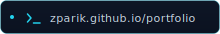

<!--
  parikshieth harish · github profile readme
  layout: asymmetric on desktop (tables), linear on mobile (cells stack in source order).
  no rented banners. one accent: #22D3EE on #0B1220.
-->

<table width="100%" border="0">
<tr>
<td width="70%" valign="top">

P A R I K S H I E T H &nbsp; H A R I S H

# Systems that watch processes and pixels.

3rd year BCA &nbsp;·&nbsp; Vellore Institute of Technology

Currently heads-down on **[PaleGuard](https://github.com/zParik/CapStoneProject)** — a 3D-CNN EDR that reads process behaviour as a spatio-temporal volume instead of a flat feature vector. Turns out you can detect malware families the training set never saw. The rest of the drawer is desktop tooling, anonymity systems, and computer vision pipelines that earn their compute. Mostly building things I wanted to exist and could not find.

</td>
<td width="4%"></td>
<td width="26%" valign="top">

 

R E A C H

  

  

</td>
</tr>
</table>

<table width="100%" border="0">
<tr>

<td width="68%" valign="top">

###  Featured work

**[PaleGuard](https://github.com/zParik/CapStoneProject)** &nbsp;Python · PyTorch · 3D-CNN
 Endpoint Detection and Response that reads process behaviour as a spatio-temporal volume instead of a flat feature vector. 88% detection on malware families never seen at training time. Solo design, implementation, evaluation. Paper under review.

**[Qyra](https://github.com/zParik/Qyra)** &nbsp;Tauri · React · TypeScript · Rust
 Free, offline, open-source PDF Swiss Army Knife. Ships as a native desktop app on Windows and Linux. Wayland edge cases patched out so the AppImage actually behaves on Arch and Hyprland.

**[CV-Project](https://github.com/zParik/CV-Project)** &nbsp;Python · CV pipeline
 Indoor navigation assist that fuses object detection with depth and scene cues to guide a user through unfamiliar interiors. The project that moved me from tinkering with models to designing the pipeline around them.

**[ARCHON](https://github.com/zParik/ARCHON)** &nbsp;TypeScript · Node · React
 Anonymous distributed messaging. Tor style relay graph, zero account information, crypto keycard authentication. Built so the operator cannot surveil its own users.

**[NotBigBrother](https://github.com/zParik/NotBigBrother)** &nbsp;JavaScript
 Privacy-conscious activity monitoring. See what you do without shipping behaviour data anywhere it does not belong.

**[Compressor](https://github.com/zParik/Compressor)** &nbsp;HTML · JS
 Browser-native file compression. No upload, no server round trip. Everything runs in the tab.

</td>

<td width="4%"></td>

<td width="28%" valign="top">

###  Stack

ML &amp; CV 

S E C U R I T Y 

W E B 

D E S K T O P &nbsp; &amp; &nbsp; M O B I L E 

D A T A &nbsp; &amp; &nbsp; I N F R A 

</td>
</tr>
</table>

###  Also in the drawer

[congenial-octo-giggle](https://github.com/zParik/congenial-octo-giggle) was my first computer vision build, a deep-learning sign language interpreter. Not noteworthy on its own. It is the through-line into CV-Project and PaleGuard. [EcresWeb](https://github.com/zParik/EcresWeb) is a Django e-commerce learning artifact kept around because the CRUD surface is the cleanest I have written.

Hackathons: [CodeCultivators at Agrithon](https://github.com/zParik/CodeCultivators---Agrithon) &nbsp;·&nbsp; [CodeCultivators at CommHackathon](https://github.com/zParik/CodeCultivators---CommHackathon) &nbsp;·&nbsp; [Devjams](https://github.com/zParik/Devjams).

<table width="100%" border="0">
<tr>
<td width="62%" valign="top">

 

</td>
<td width="4%"></td>
<td width="34%" valign="middle" align="center">

 
S C A N &nbsp; F O R &nbsp; P O R T F O L I O

</td>
</tr>
</table>
